# AWS EKS Kubernetes Cluster Deployment

## Project Overview

This project demonstrates how to deploy a fully containerized backend application on **Amazon EKS (Elastic Kubernetes Service)** using AWS best practices.  
It follows a complete workflow from building the application image to deploying it on a Kubernetes cluster managed by EKS.

The project includes:

- Launching and configuring an EC2 instance  
- Creating an EKS cluster using `eksctl`  
- Building a Docker image for the backend  
- Storing the image in Amazon ECR  
- Creating Kubernetes Deployment and Service manifests  
- Deploying the backend using `kubectl`  

---

## Architecture Overview and Workflow Diagrams:

### Part 1: Launching a Kubernetes Cluster:

- Launch and connect to an EC2 instance:  

- Launch EKS cluster using eksctl (Error):  

- Launch EKS cluster with correct IAM role (Successful):  

- Utilize CloudFormation to track creation of the EKS cluster:  

- Access EKS from the Management Console:  

- Completed overview of Part 1:  

---

### Part 2: Setting Up Kubernetes Deployment:

- EC2 and EKS setup from Part 1:  
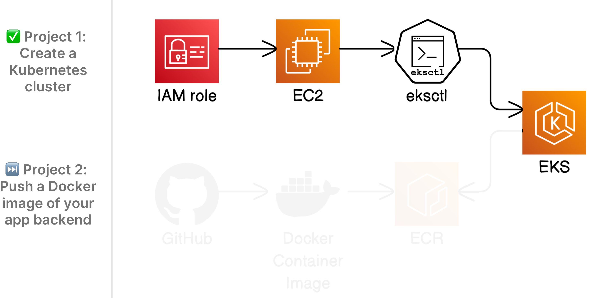

- Pulling the code for the backend from GitHub:  
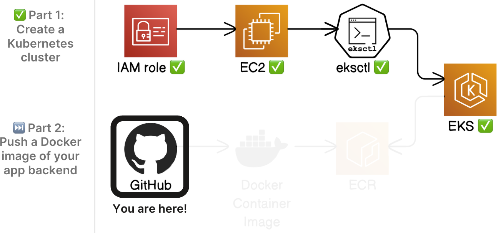

- Building the container image for the backend:  
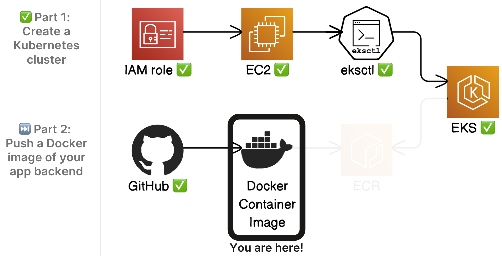

- Pushing the container image to Amazon ECR:  
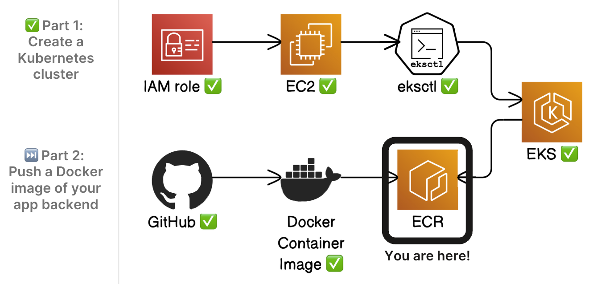

- Completed overview of Part 2:  
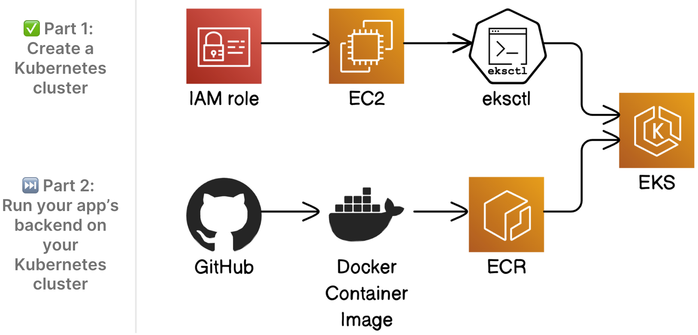

---

### Part 3: Creating Kubernetes Manifests:

- EC2 and EKS setup from Part 1:  
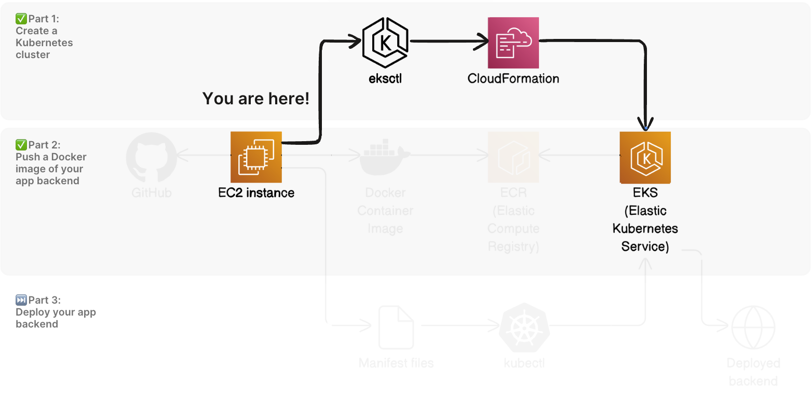

- Pulling the code from Part 2:  
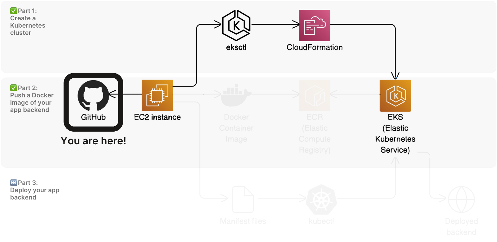

- Building the container image from Part 2:  
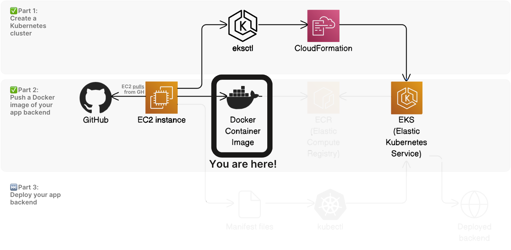

- Pushing to ECR from Part 2:  
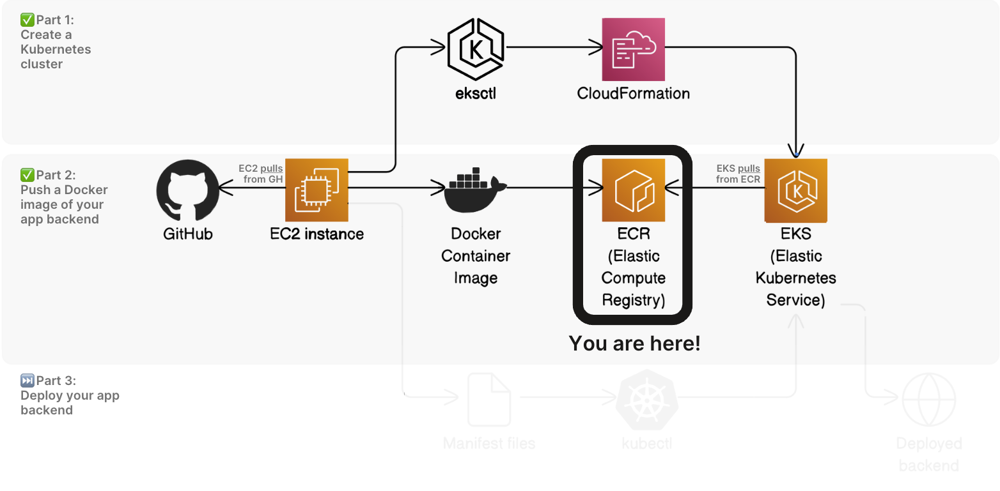

- Setting up the app for deployment by creating manifests:  
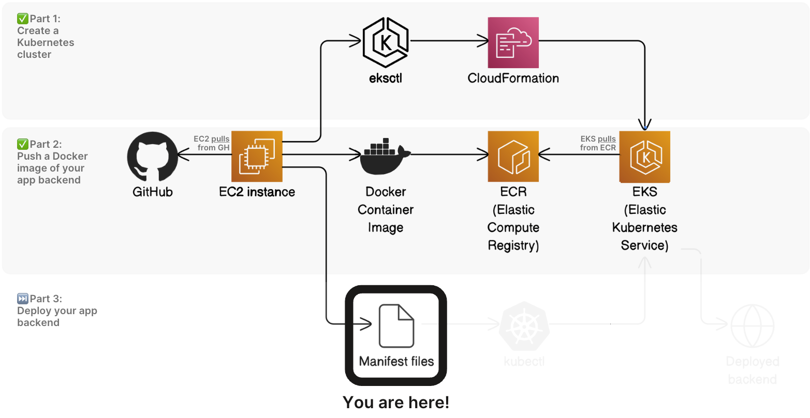

- Completed overview of Part 3:  
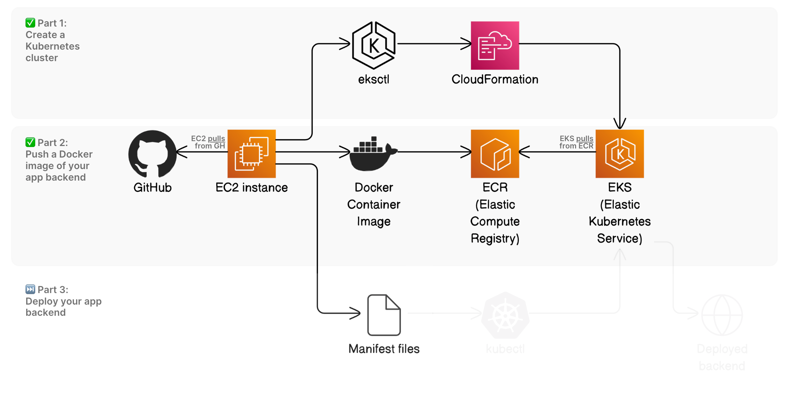

---

### Part 4: Deploying Backend with Kubernetes:

- Deploying the backend application using kubectl:  
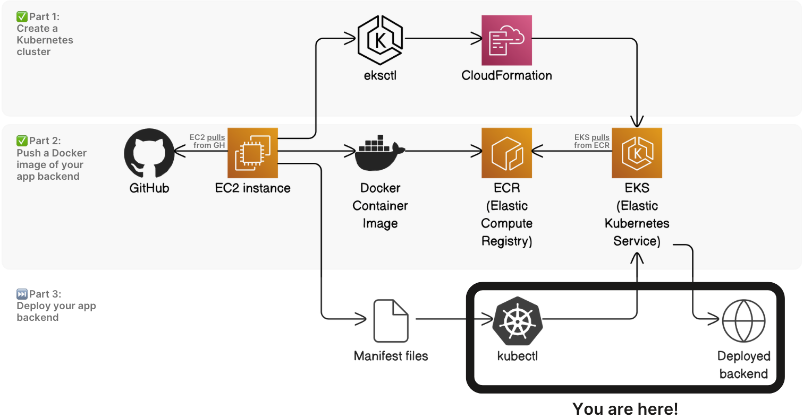

- Completed overview of Part 4 and the entire project:  
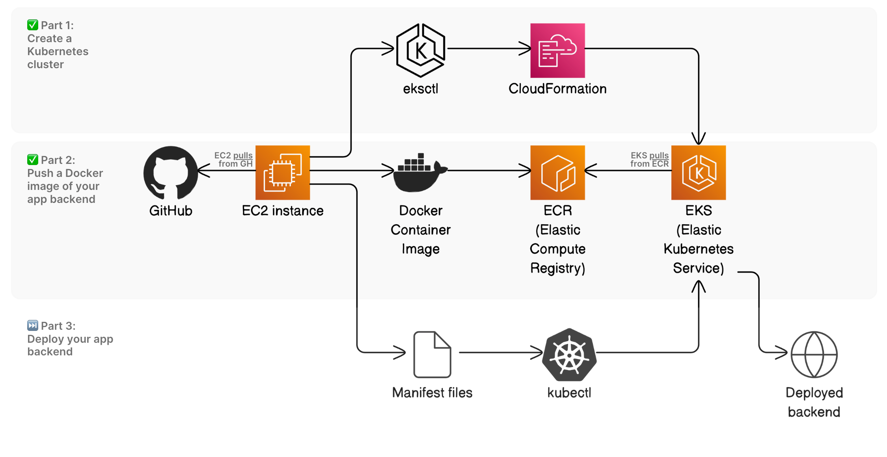

---

## Technologies Used

- **Amazon EC2** – command workstation  
- **Amazon EKS** – Kubernetes control plane  
- **Amazon ECR** – container registry  
- **AWS IAM** – permissions and roles  
- **AWS CloudFormation** – infrastructure orchestration  
- **Docker** – containerization  
- **Kubernetes** – orchestration  
- **kubectl** – cluster interaction  
- **eksctl** – cluster provisioning  
- **Git & GitHub** – version control  

---

## What I Learned

Throughout this project, I gained hands-on experience with deploying a containerized backend application on Amazon EKS and deepened my understanding of modern cloud-native workflows. Key learnings include:

- How to launch and configure an EC2 instance as a command workstation  
- How EKS manages Kubernetes control plane components behind the scenes  
- The role of IAM permissions when provisioning clusters and interacting with AWS services  
- How to build Docker images and push them to Amazon ECR for use in Kubernetes deployments  
- How Kubernetes Deployment and Service manifests define application behavior and exposure  
- How to use `kubectl` to apply manifests, inspect resources, and verify successful deployments  
- How CloudFormation automates the creation of networking and compute resources for EKS  
- The end‑to‑end workflow of containerization, registry storage, cluster provisioning, and application deployment

---
