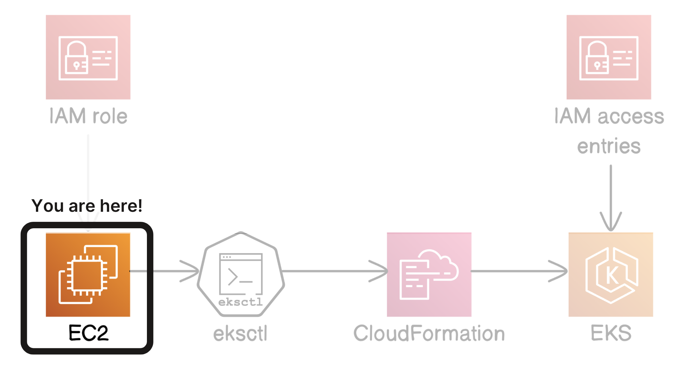
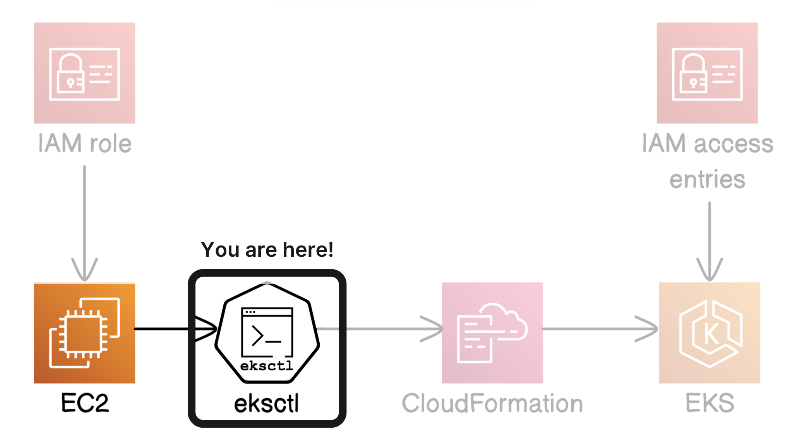
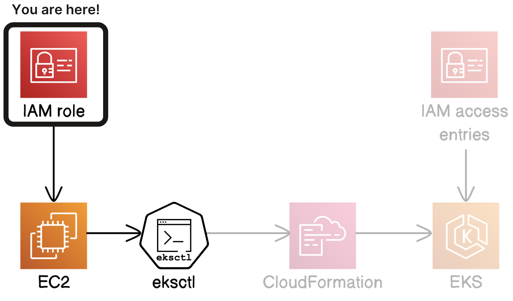
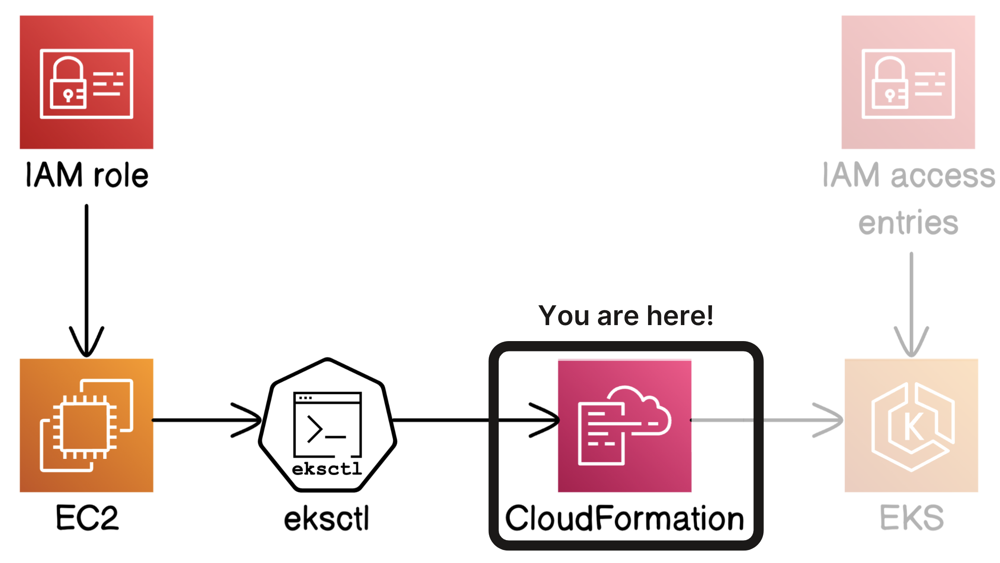
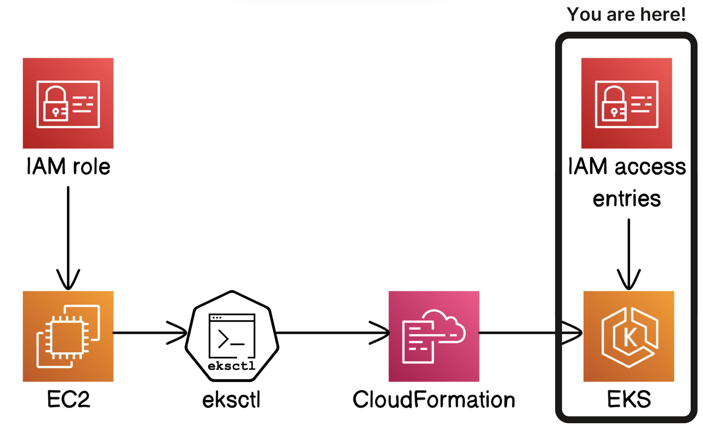
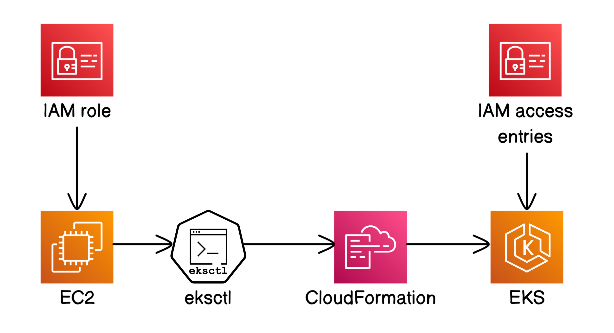

# AWS EKS Kubernetes Cluster Deployment

## Project Overview

This project demonstrates how to deploy a fully containerized backend application on **Amazon EKS (Elastic Kubernetes Service)** using AWS best practices.  
It follows a complete workflow from building the application image to deploying it on a Kubernetes cluster managed by EKS.

The project includes:

- Launching and configuring an EC2 instance  
- Creating an EKS cluster using `eksctl`  
- Building a Docker image for the backend  
- Storing the image in Amazon ECR  
- Creating Kubernetes Deployment and Service manifests  
- Deploying the backend using `kubectl`  

---

## Architecture Overview and Workflow Diagrams:

### Part 1: Launching a Kubenetes Cluster:

- Launch and Connect to an EC2 Instance:  

- Launch EKS Cluster using eksctl (Error):  

- Launch EKS Cluster with correct IAM role (Successful):  

- Utilize CloudFormation to track creation of EKS cluster:  

- Access EKS from the Management Console:  

- Completed overview of Part1:  

---

## Technologies Used

- **Amazon EC2** – command workstation  
- **Amazon EKS** – Kubernetes control plane  
- **Amazon ECR** – container registry  
- **AWS IAM** – permissions and roles  
- **AWS CloudFormation** – infrastructure orchestration  
- **Docker** – containerization  
- **Kubernetes** – orchestration  
- **kubectl** – cluster interaction  
- **eksctl** – cluster provisioning  
- **Git & GitHub** – version control  

---